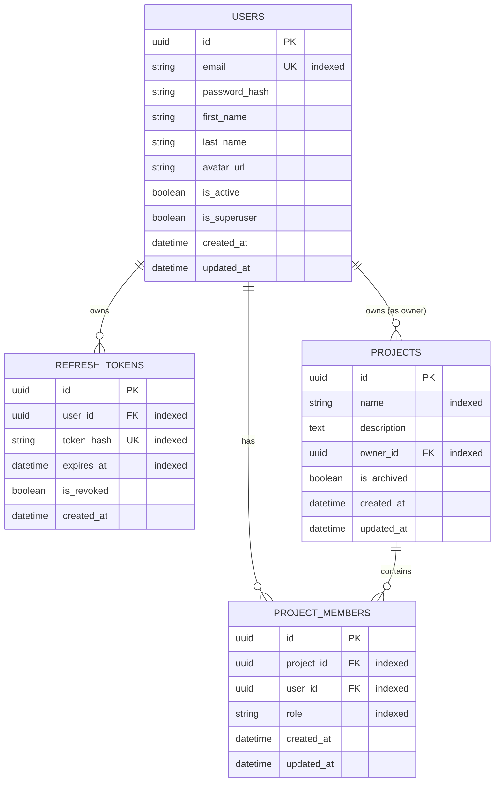

# 🏛 Project Architecture Documentation

## 1. Architectural Decisions

### Modular Monolith
The platform is organized as a modular monolith. Modules (`auth`, `users`, `projects`, `tasks`, `comments`, `notifications`, `activity`) are encapsulated with explicit models, schemas, repositories, and API routers. This ensures high velocity during early development while maintaining clean domain boundaries for future microservice extraction if needed.

### Asynchronous SQLAlchemy 2.0 & Asyncpg
- **Non-blocking I/O**: Leveraging `asyncpg` and SQLAlchemy's `AsyncEngine`/`AsyncSessionLocal` avoids thread pool saturation during high-throughput I/O.
- **Declarative Base**: `DeclarativeBase` with typed annotations (`Mapped[T]` and `mapped_column`) enforces compile-time and runtime type safety.
- **Mixins**: `UUIDMixin` and `TimestampMixin` standardise primary keys and audit timestamps across all entities.

### Role-Based Access Control (RBAC)
- **Granular Permissions Matrix**: Roles (`OWNER`, `ADMIN`, `MEMBER`, `VIEWER`) are mapped to explicit permissions (`PROJECT_VIEW`, `PROJECT_EDIT`, `TASK_CREATE`, etc.) in `app/core/permissions.py`.
- **FastAPI Dependency Factories**: Permissions are verified before endpoint handlers are invoked using `require_project_permission(permission)` and `require_project_role(role)`.

### Migration Strategy (Alembic)
- Alembic is configured in `alembic/env.py` to use async engine and dynamically read connection settings from `app.core.config.settings`.
- Models are centralized in `app.core.models` to allow automatic schema detection (`Base.metadata`) and migration generation.

---

## 2. Entity-Relationship Design (Phase 4 Current State)

