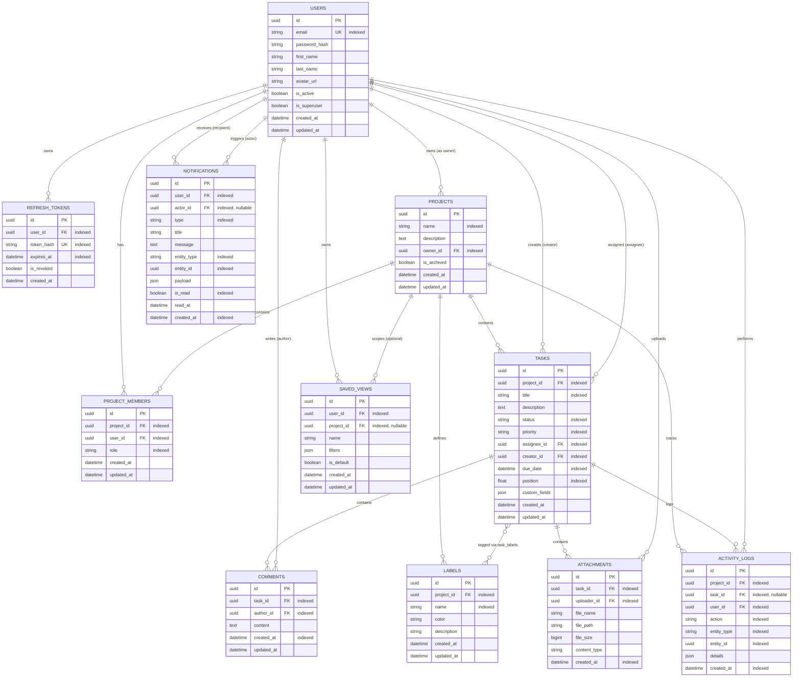

# 🏛 Project Architecture Documentation

## 1. Architectural Decisions

### Modular Monolith
The platform is organized as a modular monolith. Modules (`auth`, `users`, `projects`, `tasks`, `comments`, `labels`, `attachments`, `search`, `notifications`, `activity`) are encapsulated with explicit models, schemas, repositories, and API routers. This ensures high velocity during early development while maintaining clean domain boundaries for future microservice extraction if needed.

### Asynchronous SQLAlchemy 2.0 & Asyncpg
- **Non-blocking I/O**: Leveraging `asyncpg` and SQLAlchemy's `AsyncEngine`/`AsyncSessionLocal` avoids thread pool saturation during high-throughput I/O.
- **Declarative Base**: `DeclarativeBase` with typed annotations (`Mapped[T]` and `mapped_column`) enforces compile-time and runtime type safety.
- **Mixins**: `UUIDMixin` and `TimestampMixin` standardise primary keys and audit timestamps across all entities.

### Role-Based Access Control (RBAC)
- **Granular Permissions Matrix**: Roles (`OWNER`, `ADMIN`, `MEMBER`, `VIEWER`) are mapped to explicit permissions (`PROJECT_VIEW`, `PROJECT_EDIT`, `TASK_CREATE`, `COMMENT_CREATE`, etc.) in `app/core/permissions.py`.
- **FastAPI Dependency Factories**: Permissions are verified before endpoint handlers are invoked using `require_project_permission(permission)` and `require_project_role(role)`.

### Real-Time WebSocket Engine & Presence
- **ConnectionManager**: In-memory connection tracker supporting project rooms, client heartbeat ping/pongs, and active presence state (`presence:state`, `presence:joined`, `presence:left`).
- **Redis Pub/Sub Layer**: Multi-worker broadcast bridge ensuring messages and presence events are synchronized across horizontally scaled backend nodes.

### Background Jobs & Task Queue (ARQ / Redis)
- **Asynchronous Processing**: `app.core.queue.enqueue_job` offloads time-consuming tasks (email sending, token cleanup, metrics aggregations) to ARQ background workers with retry policies and exponential backoffs.
- **Graceful Fallback**: When Redis is temporarily unavailable in offline/test configurations, `enqueue_job` falls back gracefully without breaking HTTP request workflows.

### Migration Strategy (Alembic)
- Alembic is configured in `alembic/env.py` to use async engine and dynamically read connection settings from `app.core.config.settings`.
- Models are centralized in `app.core.models` to allow automatic schema detection (`Base.metadata`) and migration generation.

---

## 2. Entity-Relationship Design (Phase 13 Current State)

---

## 3. Rate Limiting & Security Hardening (Phase 14 Current State)

### SlowAPI & Rate Limiting Strategy
- **IP & User Key Extractors**: `get_client_ip` inspects `X-Forwarded-For`, `X-Real-IP`, and socket client host with RFC1918 safety. `get_user_or_ip_key` scopes rate limits to authenticated user IDs when available, falling back to client IP for unauthenticated routes.
- **Dual-Mode Limiter Backend**: `create_limiter` uses Redis connection URL with an instantaneous 200ms ping timeout, falling back automatically to in-memory `memory://` storage with `swallow_errors=True` for resilient zero-downtime execution.
- **Endpoint Throttling**:
  - `/api/v1/auth/login`: `5/minute` (Brute-force credential stuffing mitigation)
  - `/api/v1/auth/register`: `10/hour` (Account creation spam prevention)
  - `/api/v1/auth/refresh`: `20/minute` (Token abuse protection)
  - `/api/v1/tasks/{task_id}/attachments`: `15/minute` (Storage exhaustion prevention)
- **Standard 429 Payload**: Centralized exception handler emits structured RFC-compliant JSON responses with `Retry-After: 60` headers.

### Security Headers Middleware
- `X-Content-Type-Options: nosniff` (MIME sniffing prevention)
- `X-Frame-Options: DENY` (Clickjacking prevention)
- `X-XSS-Protection: 1; mode=block` (Legacy browser XSS filtering)
- `Referrer-Policy: strict-origin-when-cross-origin` (Referrer leakage protection)
- `Permissions-Policy: geolocation=(), microphone=(), camera=()` (Sensor restriction)
- `Content-Security-Policy: default-src 'self'; img-src 'self' data: https:; ...` (Content isolation)
- `Strict-Transport-Security: max-age=31536000; includeSubDomains` (Enforced when `ENVIRONMENT != "development"`)
- `CORS Expose Headers`: `Content-Disposition`, `X-Request-ID`, `Retry-After` exposed to frontend clients.

